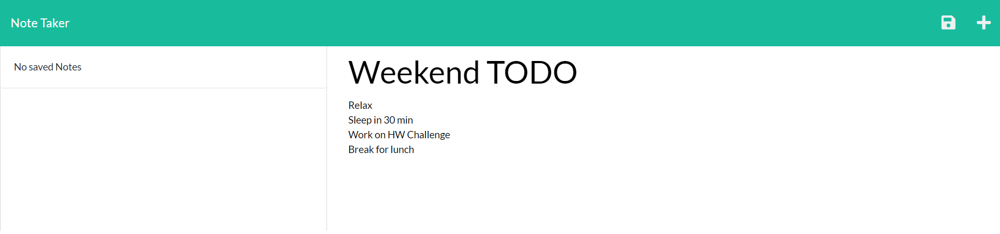

# Notepad-Express

## Description

This program allows the user to write down notes. It's as easy as clicking into the notepad and typing away. Simply start by giving your note a title then tab into the the notes section. Once you start typing a save icon will appear at the top right. Click on that to save your work.

This is a screenshot of what to expect from running the program.



The code snippet below deconstructs the note title, and text and saves it as a new object. Inside the constructor I call on a npm package of uniqid to construct a unique id for each note. 

```javascript
// Destructuring assignment for the items in req.body
    const { title, text } = req.body;

    if (title && text) {
        const newNote = {
            title,
            text,
            id: uniqid(),
        };
```

## Installation

Install npm via "npm init". Then you will need to install inquirer by using "npm i inquirer@8.2.4". A folder called node_modules will generate which means you are on the right track. Open your terminal in the root folder and start the program with "node start". After that you can type in localhost inside of your url. 

[Github Repo](https://github.com/johnfrom209/Notepad-Express)

## Usage

Once you install the correct components you can navigate to the notepad html. On that page you can click on a note to add a title, and some text. Once those are filled a save icon will appear in the top right. Click that icon and a new note will be saved. If you wish to return to that note you can click it in the side bar and it will load the information into the notepad.

## Credits

Uses Node js, inquirer. UCB coding bootcamp provided starter code.

## Contact Me

[Linkedin](https://www.linkedin.com/in/johnfrom209/)

[View my Github Repo](https://github.com/johnfrom209)

## License

Refer to the license in the Github repo.